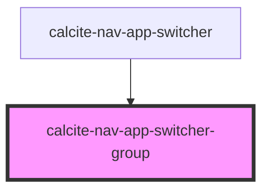

# calcite-alert

Single alert for toast notifications. To position the alert correctly and manage multiple alerts, it's recommended you wrap the alert inside the [calcite-alerts](../calcite-alerts/) component:

```html
<calcite-alerts>
  <calcite-alert>
    <div slot="alert-title">Title of alert</div>
    <div slot="alert-message">
      Message text of the alert
    </div>
    <a slot="alert-link" href="#">Retry</a>
  </calcite-alert>
</calcite-alerts>
```

## TODO

- tests
- verify aria
- document events

<!-- Auto Generated Below -->


## Properties

| Property      | Attribute      | Description | Type                       | Default     |
| ------------- | -------------- | ----------- | -------------------------- | ----------- |
| `groupTitle`  | `group-title`  |             | `string`                   | `undefined` |
| `isDraggable` | `is-draggable` |             | `boolean`                  | `undefined` |
| `type`        | `type`         |             | `"primary" \| "secondary"` | `"primary"` |


## Dependencies

### Used by

 - [calcite-nav-app-switcher](../calcite-nav-app-switcher)

### Graph


----------------------------------------------

*Built with [StencilJS](https://stenciljs.com/)*
