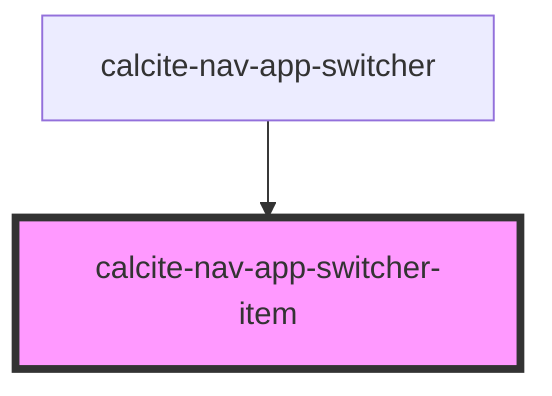

# calcite-alert

Single alert for toast notifications. To position the alert correctly and manage multiple alerts, it's recommended you wrap the alert inside the [calcite-alerts](../calcite-alerts/) component:

```html
<calcite-alerts>
  <calcite-alert>
    <div slot="alert-title">Title of alert</div>
    <div slot="alert-message">
      Message text of the alert
    </div>
    <a slot="alert-link" href="#">Retry</a>
  </calcite-alert>
</calcite-alerts>
```

## TODO

- tests
- verify aria
- document events

<!-- Auto Generated Below -->


## Properties

| Property      | Attribute      | Description                                             | Type                                     | Default     |
| ------------- | -------------- | ------------------------------------------------------- | ---------------------------------------- | ----------- |
| `color`       | `color`        | Color for the alert (will apply to top border and icon) | `"blue" \| "green" \| "red" \| "yellow"` | `"blue"`    |
| `href`        | `href`         |                                                         | `string`                                 | `undefined` |
| `imgSrc`      | `img-src`      |                                                         | `string`                                 | `undefined` |
| `isDraggable` | `is-draggable` |                                                         | `any`                                    | `undefined` |
| `theme`       | `theme`        | Select theme (light or dark)                            | `"dark" \| "light"`                      | `"light"`   |
| `type`        | `type`         |                                                         | `string`                                 | `undefined` |


## Slots

| Slot              | Description                                                                  |
| ----------------- | ---------------------------------------------------------------------------- |
| `"alert-link"`    | Optional action to take from the alert (undo, try again, link to page, etc.) |
| `"alert-message"` | Main text of the alert                                                       |
| `"alert-title"`   | Title of the alert (optional)                                                |


## Dependencies

### Used by

 - [calcite-nav-app-switcher](../calcite-nav-app-switcher)

### Graph


----------------------------------------------

*Built with [StencilJS](https://stenciljs.com/)*
