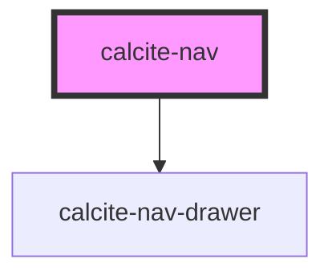

# calcite-nav

Calcite nav provides consistent positioning and arrangement of common navigational components. Clearly defined slots and corresponding components, used together, help create consistent and familiar experiences as users navigate between and within applications.

While there is no general slot for content, you can position custom content in the "nav-actions-start" and "nav-actions-end" slots.

The rest of the named slots: logo, title, profile, and menu-start / menu-end ...

A "kitchen sink" example:

```
  <calcite-shell>
    <div slot="shell-header">
      <calcite-nav>
        <calcite-nav-logo text="Great App Name" text-enabled slot="nav-logo" src='../assets/images/online-logo.svg' href></calcite-nav-logo>
        <div slot="nav-actions-start">
          <calcite-chip color="yellow">Unsaved Changes</calcite-chip>
        </div>
        <calcite-nav-menu slot="nav-menu-start">
          <calcite-nav-menu-item icon="home" text="Home" text-enabled></calcite-nav-menu-item>
          <calcite-nav-menu-item icon="gallery" text="Gallery" text-enabled></calcite-nav-menu-item>
          <calcite-nav-menu-item icon="map" icon-position="end" text="Map" text-enabled></calcite-nav-menu-item>
          <calcite-nav-menu-item icon="globe" text="Scene"></calcite-nav-menu-item>
          <calcite-nav-menu-item icon="superimpose" text="Sample Name"></calcite-nav-menu-item>
          <calcite-nav-menu-item active text="Groups" text-enabled></calcite-nav-menu-item>
          <calcite-nav-menu-item text="Organization" text-enabled></calcite-nav-menu-item>
        </calcite-nav-menu>
        <div slot="nav-actions-end">
          <calcite-button>Save</calcite-button>
          <calcite-action icon="search" scale="l"></calcite-action>
          <calcite-action icon="bell" scale="l" indicator></calcite-action>
          <calcite-action icon="app-launcher" scale="l"></calcite-action>
        </div>
        <calcite-nav-profile slot="nav-profile" user-name="Michael Carter-Williams" user-organization="NBA, LLC">
        </calcite-nav-profile>
      </calcite-nav>
      <calcite-nav type="secondary">
        <calcite-nav-menu slot="nav-menu-start">
          <calcite-nav-menu-item breadcrumb text="All Content" text-enabled></calcite-nav-menu-item>
          <calcite-nav-menu-item breadcrumb text="Applications" text-enabled></calcite-nav-menu-item>
        </calcite-nav-menu>
        <calcite-nav-menu slot="nav-menu-end">
          <calcite-nav-menu-item text-enabled text="Home"></calcite-nav-menu-item>
          <calcite-nav-menu-item text-enabled text="Gallery"></calcite-nav-menu-item>
          <calcite-nav-menu-item text-enabled text="Map"></calcite-nav-menu-item>
          <calcite-nav-menu-item text-enabled text="Scene"></calcite-nav-menu-item>
          <calcite-nav-menu-item text-enabled text="Groups"></calcite-nav-menu-item>
        </calcite-nav-menu>
      </calcite-nav>
    </div>
    ...
    </calcite-shell>

```

<!-- Auto Generated Below -->

## Properties

| Property | Attribute | Description                                             | Type                                     | Default     |
| -------- | --------- | ------------------------------------------------------- | ---------------------------------------- | ----------- |
| `color`  | `color`   | Color for the alert (will apply to top border and icon) | `"blue" \| "green" \| "red" \| "yellow"` | `"blue"`    |
| `icon`   | `icon`    | If false, no icon will be shown in the alert            | `boolean`                                | `false`     |
| `theme`  | `theme`   | Select theme (light or dark)                            | `"dark" \| "light"`                      | `"light"`   |
| `type`   | `type`    | Select the position of the nav                          | `"primary" \| "secondary"`               | `"primary"` |

## Events

| Event           | Description | Type               |
| --------------- | ----------- | ------------------ |
| `drawerUpdated` |             | `CustomEvent<any>` |

## Slots

| Slot              | Description                                                                  |
| ----------------- | ---------------------------------------------------------------------------- |
| `"alert-link"`    | Optional action to take from the alert (undo, try again, link to page, etc.) |
| `"alert-message"` | Main text of the alert                                                       |
| `"alert-title"`   | Title of the alert (optional)                                                |

## Dependencies

### Depends on

- [calcite-nav-drawer](../calcite-nav-drawer)

### Graph



---

_Built with [StencilJS](https://stenciljs.com/)_
